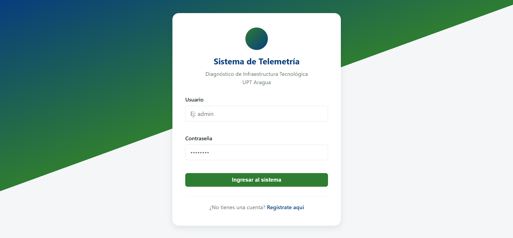
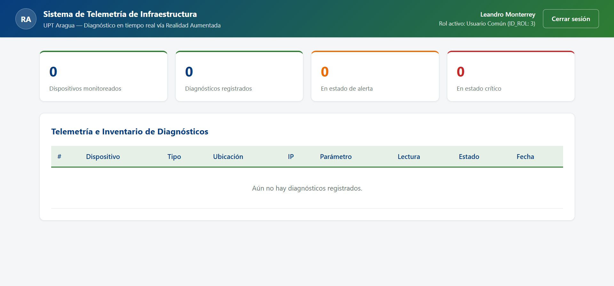
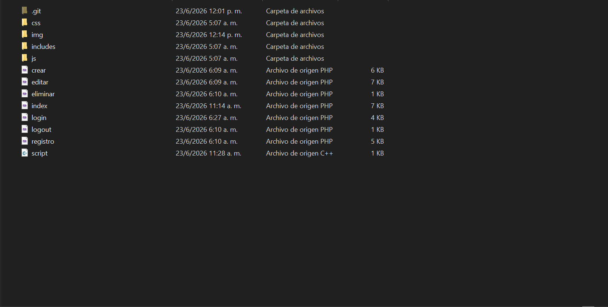

# Sistema de Telemetría de Infraestructura y Diagnóstico en Tiempo Real vía Realidad Aumentada
### 🏫 Universidad Politécnica Territorial del Estado Aragua "Federico Brito Figueroa" (UPT Aragua)
**Programa Nacional de Formación (PNF) en Informática**

---

## 📸 Vista Previa del Sistema

### Pantalla de Inicio de Sesión


### Panel Principal (Dashboard de Telemetría)


---

## 📌 Descripción del Proyecto
Este proyecto propone el desarrollo e implementación de una solución de software que unifica el entorno físico de la infraestructura de redes con datos de telemetría lógica mediante **Realidad Aumentada (RA)**. El sistema centraliza, procesa y expone métricas críticas (temperatura, tráfico de datos y estatus energético) de servidores, switches y routers de los laboratorios y nodos de la **UPT Aragua**.

A través de una aplicación móvil, el personal técnico puede escanear los activos físicos de hardware y observar capas tridimensionales dinámicas con alertas cromáticas basadas en el estado operativo actual, optimizando los tiempos del mantenimiento preventivo y mitigando errores de diagnóstico.

---

## 👥 Integrantes y Autoría
* **Autor:** Dariem Samir Sameh Maklad Carvajal (C.I.: 32.139.887)
* **Coordinador de Proyecto:** Karlis Zambrano
* **Colaborador / Co-desarrollador:** Leandro Monterrey

---

## 🛠️ Arquitectura del Sistema y Tecnologías
El ecosistema se divide en un núcleo de gestión web centralizado (**Backend/API**) y la interfaz móvil de inmersión (**Módulo de RA**):

### Estructura de Archivos del Servidor Central (PHP/MySQL)

UPT_U3U/
│
├── css/
│   └── style.css            # Hoja de estilos global, variables y layouts flexibles
│
├── includes/
│   ├── config_session.php   # Gestión segura de sesiones HTTP y regeneración de IDs
│   └── db.php               # Conector PDO y abstracción de la Base de Datos
│
├── js/
│   └── script.js            # Lógica interactiva del frontend y peticiones asíncronas
│
├── crear.php                # CRUD: Registro y aprovisionamiento de nuevos nodos/dispositivos
├── editar.php               # CRUD: Actualización de parámetros técnicos y umbrales
├── eliminar.php             # CRUD: Depuración segura de activos del inventario
├── index.php                # Dashboard principal de control de telemetría
├── login.php                # Interfaz de acceso y autenticación multifactorial
├── logout.php               # Cierre seguro de sesiones destructivas
├── registro.php             # Formulario de registro para operadores autorizados
└── script.cc                # Script / Driver de control de hardware de red


### Características Técnicas del Backend:
* **Seguridad de Sesión:** Implementación rigurosa en `config_session.php` para prevenir ataques de fijación de sesión mediante la regeneración de identificadores de manera reactiva.
* **Estilos Limpios y Modernos:** CSS basado en propiedades personalizadas (`:root`) para un acoplamiento cromático institucional rápido (Verdes, Azules y Grises mate) y layouts adaptables libres de frameworks pesados.
* **Control de Acceso Basado en Roles (RBAC):** Restricción estricta de vistas según el nivel del usuario (`ID_ROL`):
    * `Rol 1: Administrador` (Acceso total al CRUD y configuraciones de red).
    * `Rol 2: Técnico` (Registro de métricas, lecturas avanzadas y diagnósticos).
    * `Rol 3: Usuario Común` (Visualización del panel de inventario y alertas generales).

---

## 🚀 Funcionalidades Principales
1.  **Dashboard Central de Telemetría:** Panel web intuitivo que muestra en tiempo real indicadores clave como dispositivos monitoreados, diagnósticos registrados, estados de alerta y estados críticos.
2.  **Motor de Reconocimiento de Patrones (RA):** Vinculación de la cámara del dispositivo móvil con marcadores geométricos u ópticos fijados en los Racks de red para superponer tarjetas flotantes contextuales.
3.  **Algoritmo de Alertas Cromáticas Inmersivas:** Evaluación automatizada de umbrales operativos configurados en la base de datos que tiñe las interfaces tridimensionales según la gravedad:
    * 🟢 **Verde:** Funcionamiento óptimo / Estado Estable.
    * 🟡 **Amarillo:** Tráfico elevado o temperatura próxima al límite / Alerta Preventiva.
    * 🔴 **Rojo:** Pérdida de paquetes, sobrecalentamiento o falla de energía / Estado Crítico.
4.  **API REST en JSON:** Interfaz intermedia automatizada que transforma las lecturas tomadas del hardware en objetos JSON consumibles de manera inmediata por el cliente móvil.

---

## 📋 Requisitos de Instalación (Entorno Local)

### 1. Clonar el repositorio
Ingresa a la terminal de tu sistema, posiciónate en el directorio de despliegue (ej. `C:/xampp/htdocs/` en XAMPP o `/var/www/html/` en Linux) y ejecuta:
```bash
git clone [https://github.com/tu_usuario/tu_repositorio.git](https://github.com/tu_usuario/tu_repositorio.git) upt_u3u
cd upt_u3u
